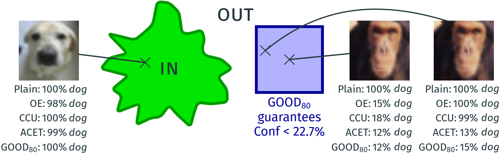

# Provable Worst Case Guarantees for the Detection of Out-of-Distribution Data

**Julian Bitterwolf, Alexander Meinke and Matthias Hein**

**University of Tübingen**

[https://arxiv.org/abs/XXXX.XXXX](https://arxiv.org/abs/XXXX.XXXX)

## The problem of provably robust OOD detection

Standard deep neural networks for image classification tend to have high confidence even on out-of-distribution (OOD) inputs that do not belong to any of the available classes.
This is a big problem as (guaranteed) low confidence of a classifier when it operates out of its training domain can otherwise be used to trigger human intervention or to let the system try to achieve a safe state when it 'detects' that it is applied outside of its specification.

Deep neural networks are also notoriously susceptible to small adversarial perturbations in the  input which change the decision of a classifier. A certain robustness against such pertrubations can be achieved with adversarial training and variations, which perform well empirically, but typically cannot give any robustness guarantees. Certified adversarial robustness has been achieved by explicit computation of robustness certificates and randomized smoothing. 

Adversarial changes to generate high confidence predictions on the out-distribution have received much less attention although it has been shown early on that they can be used to fool a classifier. Thus, even if a classifier consistently manages to identify samples as not belonging to the in-distribution, it might still assign very high confidence to only marginally perturbed samples from the out-distribution.

Our Guaranteed Out-Of-distribution Detection (GOOD) training scheme allows to provide worst-case OOD guarantees not only for far away OOD inputs like noise, but also for images from related but different image datasets. 
For this purpose we use the techniques from interval bound propagation to derive a provable upper bound on the maximal confidence of the classifier in an $l_\infty$-ball of radius $\epsilon$ around a given point. By minimizing this bound on the out-distribution, we arrive at the first models which have guaranteed low confidence even on image datasets related to the original one; e.g., we get state-of-the-art results on separating letters from EMNIST from digits in MNIST even though the digit classifier has never seen any images of letters at training time. In particular, the guarantees for the training out-distribution generalize to other out-distribution datasets. In contrast to classifiers with certified adversarial robustness on the in-distribution, GOOD has the desirable property to achieve provable guarantees for OOD detection with almost no loss in accuracy on the in-distribution task.

**Left:** On the in-distribution CIFAR-10 all methods have similar high confidence on the image of a *dog*. **Middle:** For the OOD image of a *chimpanzee* from CIFAR-100 the plain model is overconfident. **Right:** When maximizing the confidence inside the $l_\infty$-ball of radius $0.01$ around this image (for the OE model), also CCU and OE become overconfident. ACET and our GOOD\textsubscript{80} perform well in having empirical low confidence, but only GOOD\textsubscript{80} guarantees that the confidence in that $l_\infty$-ball around the middle image is less than 15.5\% for any class (note that $10\%$ corresponds to maximal uncertainty).

## 